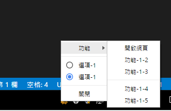

# 通知區域

## 說明

研華圖控程式在Window上面的通知區域放置依一個常駐程式。
這邊測試Electron的功能

```ts
/** 
 * 引入相關的函式庫
 * */
import { app, Menu, Tray, shell } from 'electron';
let tray: Electron.Tray = null;//全域變數避免被回收
app.on('ready', () => {
    tray = new Tray(`${__dirname}/icon.png`);
    const contextMenu = Menu.buildFromTemplate([
        {
            label: '功能', submenu: [
                {
                    label: '開啟網頁', click: () => {
                        //這邊可以定義按下按鈕後要出現的事件
                        shell.openExternal('http://www.gigaenergy.com.tw/')
                    }
                },
                { label: '功能-1-2' },
                { label: '功能-1-3' },
                {
                    type: 'separator' //分隔線
                },
                { label: '功能-1-4' },
                { label: '功能-1-5' }
            ]
        },
        {
            type: 'separator'
        },
        { label: '選項-1', type: 'radio' },
        { label: '選項-1', type: 'radio', checked: true },
        {
            type: 'separator'
        },
        {
            label: '關閉', click: () => {
                process.exit();
            }
        }
    ]);
    tray.setToolTip('This is my application.');
    tray.setContextMenu(contextMenu);
    tray.on('click', (event) => {
        //windows上按左鍵也能出現工具列
        tray.popUpContextMenu(contextMenu);
    });
});
```

## 執行結果：


